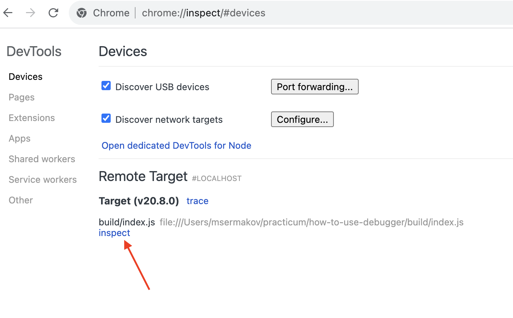
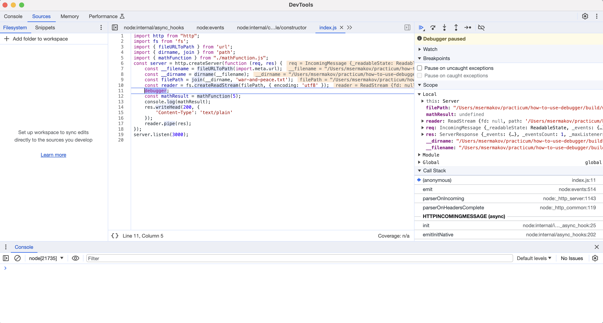
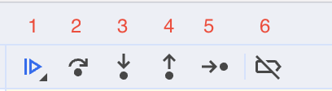
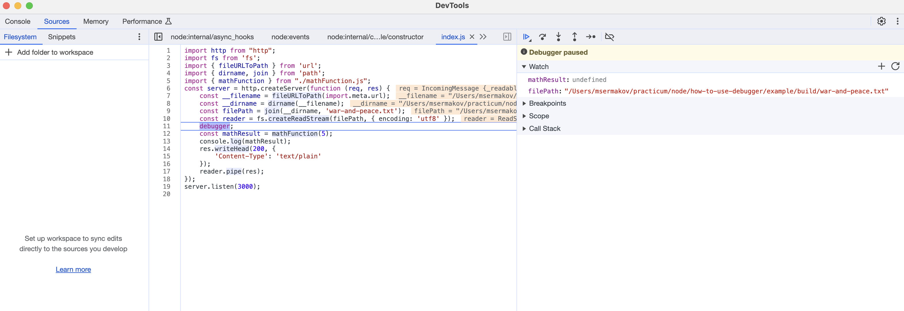
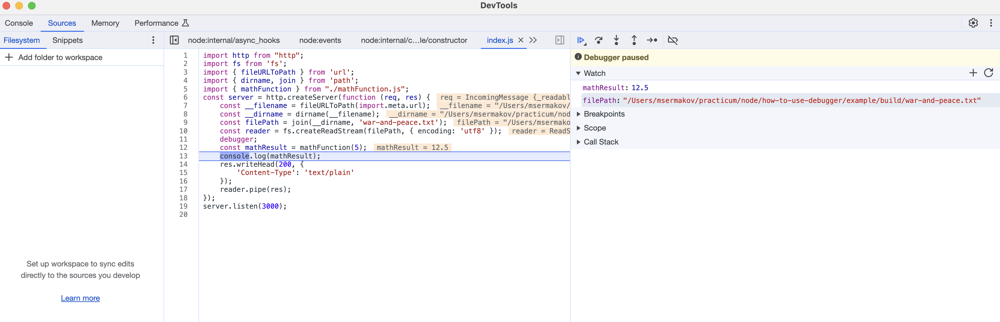
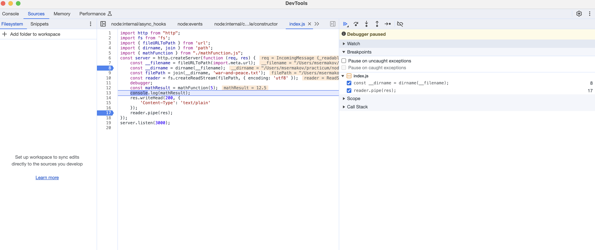
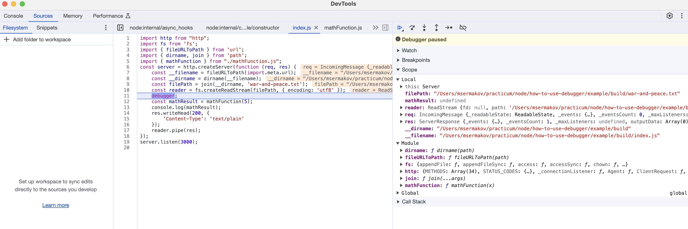
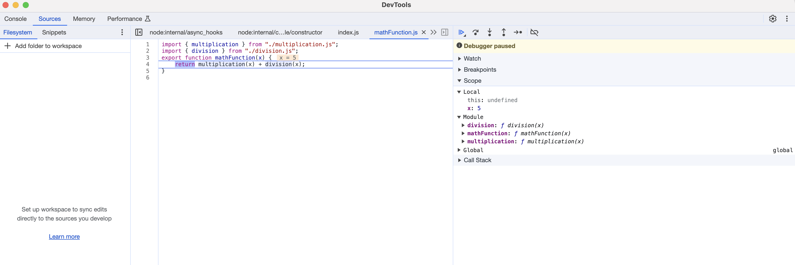
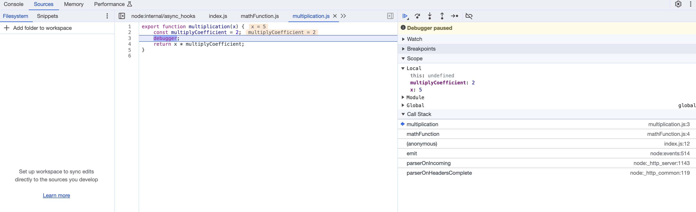
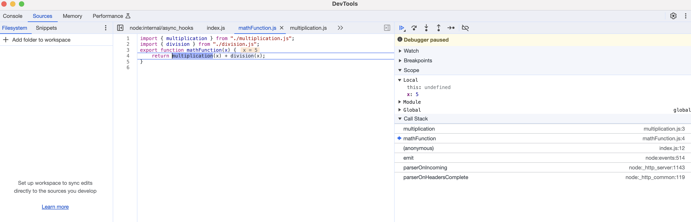

# Отладка Node.js приложения

Код без ошибок пишет только тот, кто не пишет код. Вы наверняка убедились в этом с первого же месяца обучения. 
В этом уроке на примере небольшого node-проекта мы увидим как можно запустить отладку в браузере, а так же изучим элементы управления браузерным отладчиком.
Проект в нашем примере использует ES-модули и написан на TypeScript. Код и настройки в tsconfig.json вы можете найти в репозитории по ссылке, так же в нем будет инструкция по запуску.

## Отладка
Для отладки программ в их коде нужно ставить `брейкпоинты`, это можно сделать, написав в коде программы ключевое слово `debugger`. Давайте в нашем примере поставим такой брейкпоинт
```ts
import http from "http";
import fs from 'fs'
import { fileURLToPath } from 'url';
import { dirname, join } from 'path';
import { mathFunction } from "./mathFunction.js";

const server = http.createServer(function (req, res) {
    const __filename = fileURLToPath(import.meta.url);
    const __dirname = dirname(__filename);
    const filePath = join(__dirname, 'war-and-peace.txt');
    const reader = fs.createReadStream(filePath, {encoding: 'utf8'});
    debugger // наш брейкпоинт 
    const mathResult = mathFunction(5);

    console.log(mathResult);

    res.writeHead(200, {
        'Content-Type': 'text/plain'
    })

    reader.pipe(res);
})

server.listen(3000)
```
## Запуск отладчика
Сначала запустим сам пример, который будем отлаживать. Для запуска примера необходимо выполнить два шага:
1. транспилировать TypeScript в JavaScript, этот шаг необходим только в случае, если ваш проект использует TypeScript.
2. запустить полученный JavaScript код командой `node --inspect build/index.js`, флаг --inspect необходим для запуска отладки.

Оба этих шага выполнит команда `npm run start` из package.json в примере. В результате вызова этой команды мы увидим такой вывод
```bash
> how-to-use-debugger@1.0.0 start
> tsc && node --inspect build/index.js

Debugger listening on ws://127.0.0.1:9229/cfc3e168-5112-4562-9377-c3a782fe7bff
For help, see: https://nodejs.org/en/docs/inspector
```

Теперь запустим отладчик, в его роли мы будем использовать браузер. Для этого нам понадобится любой chromium-браузер, например Яндекс.Браузер или сам Chrome.
В адресной строке введите `chrome://inspect` и перед вами откроется следующее окно


В разделе Remote Target можно увидеть запущенную сессию отладки, при нажатии на кнопку `inspect` (указана стрелкой), нам откроется окно devtools, где во вкладке `source`
мы и сможем отлаживать наш код.


## Анатомия devtools
На данный момент мы имеем запущенную сессию отладки, а также браузерный клиент, где эту отладку можно осуществлять, остался последний шаг - начать выполнять саму программу.
Для этого в другой вкладке браузера откройте адрес `http://localhost:3000` - адрес нашего проекта. Как только вы это сделаете node начнет обрабатывать ваш запрос и прервется в том месте,
где мы оставили `debugger`.

### Панель управления ходом выполнения кода
Теперь подробнее остановимся на элементах управления браузерным отладчиком. Начнем с кнопок, позволяющих управлять ходом выполнения кода.

;

Для большей ясности все кнопки подписаны номерами
1. Первая кнопка - продолжить выполнение кода до следующего брейкпоинта
2. Вторая кнопка - перейти к следующей строке кода в рамках текущего scope
3. Третья кнопка - войти внутрь выполнения функции
4. Четвертая кнопка - выйти из выполнения функции на один уровень выше
5. Пятая кнопка - выполнить один шаг вперед в процессе выполнения программы
6. Шестая кнопка - отключить все брейкпоинты
Далее рассмотрим разделы в отладчике, которые помогают следить за состоянием выполнения программы на каждом шаге.
### Раздел Watch
Раздел предназначен, исходя из названия, для того, чтобы следить за изменением значений переменных. Изначально раздел пустой, так как все переменные разработчик
добавляет туда сам нажатием кнопки `+`. Например, добавим в этот раздел переменную `mathResult` из нашего примера. В момент остановки на брейкпоинте
`mathResult` еще не определен.

Далее два раза нажмем на вторую кнопку в панели управления и остановимся на 13 строке в файле `build/index.js`. К этому моменту функция mathFunction уже выполнилась,
и mathResult имеет новое числовое значение.

### Раздел Breakpoints
Брейкпоинты можно указывать не только в коде с помощью ключевого слова `debugger`, но и нажатием на номер строки на полях в devtools. В разделе Breakpoints отображаются такие брейкпоинты.
В нашем примере это может показаться не сильно полезным, так как пример совсем маленький, но в больших проектах с множеством файлов при отладке сложных проблем этот раздел сильно помогает ориентироваться.
На скрине ниже вы можете увидеть наглядный пример.

### Раздел Scope
Данный раздел похож на раздел Watch, за тем исключением, что здесь отображаются значения всех переменных, которые доступны из текущей области видимости. Запустим наш пример заного, остановившись на брейкпоинте debugger,
который мы оставили в коде.

Раздел Scope в свою очередь делится на 3 других раздела:
1. Local - переменные существующие в рамках области видимости текущей выполняемой функции
2. Module - импортированные модули из библиотек зависимостей
3. Global - переменные из глобальной области видимости

Для наглядности давайте зайдем внутрь выполнения функции `mathFunction` и посмотрим, что будет лежать в Scope. Для этого с помощью второй кнопки панели управления перейдем на строку 12 и с помощью третьей кнопки провалимся внутрь функции

### Раздел Call Stack
Раздел Call Stack показывает порядок функций, которые были вызваны для того чтобы выполнение программы попало в ту точку, где мы оставили брейкпоинт. Иными словами это путь, который проходит программа до определенного нами этапа.

Для демонстрации поставим второй брейкпоинт в файле `multiplication.ts` и перезапустим наш пример.
```ts
export function multiplication(x: number): number {
    const multiplyCoefficient = 2;
    debugger
    return x * multiplyCoefficient
}
```
Дойти до второго брейкпоинта можно с помощью первой кнопки в панели управления, чтобы выполнение сразу остановилось на следующем брейкпоинте.


На скрине видно, что в функцию `multiplication` выполнение попало из функции `mathFunction`. Каждая строка в разделе Call stack кликабельна, то есть мы можем попасть на каждый из предыдущих этапов выполнения программы
 и увидеть каким именно образом была вызвана интересующая нас функция. Для демонстрации нажмем на строку с `mathFunction` и увидим конкретное место в коде, где была вызвана `multiplication`.


## Итоги
1. Мы узнали как нужно запустить приложение для отладки: команда `node --inspect <путь к файлу>.js`
2. Разобрали как использовать devtools браузера в качестве визуального интерфейса для отладки. Строго говоря, отлаживать можно не только в браузере, но и в ide, подробнее об этом можно прочитать [тут](https://nodejs.org/en/docs/guides/debugging-getting-started#inspector-clients)
3. На примерах посмотрели из чего состоит devtools браузера и как ими правильно пользоваться. Тут стоит отметить, что все сказанное про devtools в этом уроке так же верно и для отладки приложений, запускаемых в браузере 
