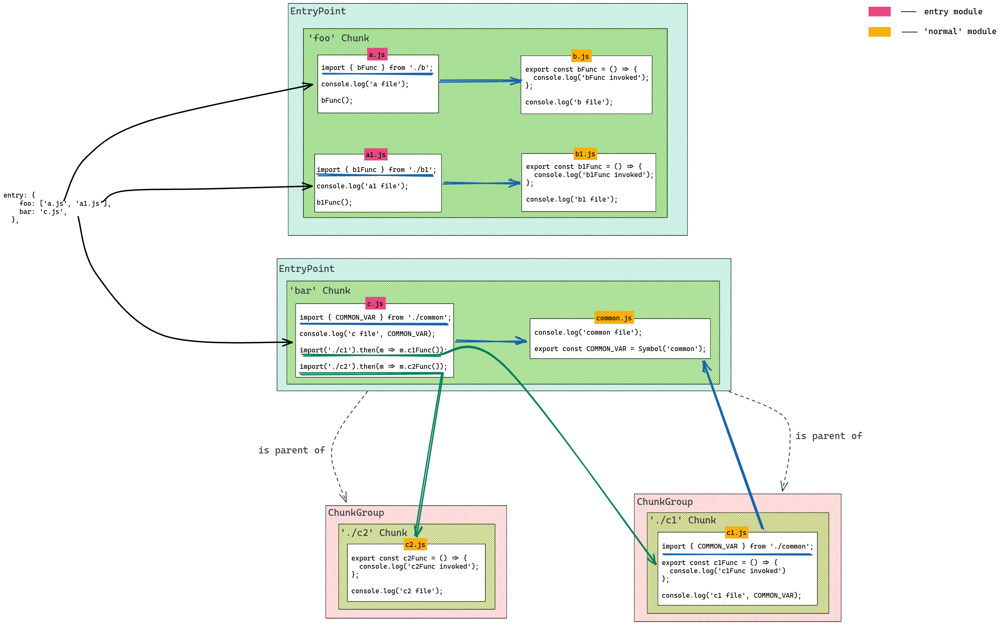

В прошлом уроке мы разобрались что такое модуль и как строится граф модулей. В этом мы рассмотрим такое понятие как чанки, что это такое, и какое отношение к ним имеет граф модулей

### Chunk, ChunkGroup, EntryPoint
Сразу определимся с понятиями, которые будем использовать в дальнейшем

**Chunk** - набор одного или нескольких модулей из графа модулей. Для каждого значения в поле entry обязательно создается как минимум один чанк. Так же чанки могут создаваться неявно при помощи динамических импортов ```import()```. Физически каждый отдельный чанк, каким бы образом он не был создан, представляет из себя файл с кодом, лежаший в директории dist.

**ChunkGroup** - группа, объединяющаяя в себе несколько чанков. Несколько ChunkGroup имеют между собой связи вида родитель/наследник. Когда один из чанков в ```ChunkGroup A``` имеет зависимость в виде динамического иморта, создается новый отдельный ```ChunkGroup B```, который будет наследником от родительской группы чанков ```ChunkGroup A```.

**EntiryPoint** - вид ChunkGroup, которая создается для каждого значения в entry.

### Граф чанков
На данный момент из прошлого урока мы знаем, что в процессе сборки приложения вебпак создает граф модулей. На его основе происходит следующий этап сборки - построение графа чанков. В этот раз не будем сильно углублятся в процесс построения графа, опишем лишь его начальный этап. 

Для каждого значения в entry создается EntryPoint, так как это вид ChunkGroup, в нем обязательно находится хотя бы один чанк. То есть если в объекте entry три точки входа, то будет создано три EntryPoint, в каждой из которых будет чанк, также называемый entrypoint chunk. Модули, соответствующие файлам в entry называются entry modules и каждый из них находится в своем entrypoint chunk. Стоит отметить, что один чанк может иметь более одного entry module. 

Рассмотрим пример, в котором увидим, то что описали выше связь родитель/наследник между группами чанков, сами чанки и EntryPoint. Ниже привиден фрагмент конфига вебпака и диаграмма получившегося графа чанков.

```javascript
entry: {
    foo: [path.join(__dirname, 'src', 'a.js'), path.join(__dirname, 'src', 'a1.js')],
    bar: path.join(__dirname, 'src', 'c.js'),
  },
```



Данная картинка иллюстрирует очень упрощенную версию графа чанков, но на ней зорошо видны чанки и отношения между группами чанков. Мы видим четыре чанка:
* чанк foo
* чанк bar
* чанк ./c1
* чанк ./c2
Для каждого из них будет соответствующий выходной файл с кодом. Чанк **foo** имеет четыре модуля, два из которых являются entry module, и два других будем считать просто normal module. Аналогично устроен и чанк **bar**, только у него один entry module и один normal module. Также можно заметить, что использование динамического импорта ```import(...).then(...)``` создает отдельный ChunkGroup, чьим родителем будет являться EntryPoint и который включает в себя свой чанк **./c2** со своим модулем **c2.js**. В данном случае суть создания отдельной ChunkGroup для динамического импорта состоит в том, что файл, содержащий код отдельного чанка может быть загружен ассинхронно. На этом приеме основан такой способ оптимизации сборки как code split, о котором мы поговорим в следующем уроке.


---

### хз этот кусок наверное надо будет убрать

Рассмотрим пример ниже. Для данного объекта entry будет создан чанк с именем **foo**, который будет включать в себя два entry module, для ```a.js``` и ```b.js``` соответственно. И, конечно чанк будет принадлежать созданному предварительно EntryPoint.

```
// webpack.config.js
entry: {
  foo: ['./a.js', './b.js'],
},
```
[оригинальная статья](https://indepth.dev/posts/1482/an-in-depth-perspective-on-webpacks-bundling-process)


TODO написать про аст