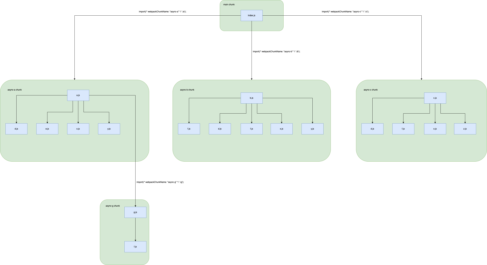

В этом уроке поговорим о таком способе оптимизации сборки как code-split. О том какую проблему он решает и как его можно реализовать. Для наглядности все повествование будет построено вокруг примера с кодом, на котором можно будет увидеть проблему и результат работы code-split.

## Сетапим пример
Для начала опишем как устроен пример проекта, к которому мы будем применять code-split. Он имеет следующую файловую структуру.

```
├── a.js
├── b.js
├── c.js
├── d.js
├── e.js
├── f.js
├── g.js
├── index.js
├── node_modules
│   ├── x.js
│   ├── y.js
│   └── z.js
└── webpack.config.js

```

Содержимое вебпак конфига
```js
{
  mode: 'production',
  entry: {
    main: './src/index.js',
  },
  output: {
    path: path.join(__dirname, 'dist'),
    filename: '[name].js',
    clean: true,
  },
  optimization: {
    // явно говорим вебпаку не минифицировать выходной код
    minimize: false,
    splitChunks: false,
  },
  context: __dirname,
};
```

Исходный код приложения можно найти по ссылке (ССЫЛКА). Склонируйте себе данное приложение и выполните две команды ```npm install``` и ```npm run build```. У вас появится папка dist, в которой вы увидете пять файлов, те самые чанки, получившиеся в результате сборки приложения. Обратите внимание, что в конфиге вебпака указана лишь одна входная точка ```main```. Один из чанков имеет соответсвующее имя - ```main```. Другие четверо были получены в результате использования динамического импорта ```import()```. На этой диаграмме отображены связи между чанками и какие модули относятся к каким чанкам.


Неподписанные стрелки означают обычные es импорты вида ```import d from './d';```, фиолетовые означают динамические импорты ```import(/* webpackChunkName: "async-a" */ './a');```. Зеленые блоки означают чанки, синие - модули в этих чанках. Чанк main имеет три дочерних чанка async-b, async-c и async-а, который в свою очередь имеет свой дочерний чанк async-g.

## В чем проблема?
Давайте обратим внимание на содержимое чанков в папке dist. Чанк main содержит в себе runtime код вебпака, который не имеет прямого отношения к приложению, а реализует логику загрузки других чанков. Оставшиеся чанки содержат в себе по большей части код для импортирования и экспортирования модулей, а также сам исходный код файлов.

Можно заметить, что содержимое файла x.js ```some content from `x.js``` встречается целых три раза, в чанках async-b, async-c и async-а. Напомним, что чанк с кодом приложения попадает в браузер по средствам выполнения HTTP запроса за этим чанком. Представьте, что файл x.js содержит не одну, а сотни строк кода. Таким образом запросы за чанками, которые содержат в себе x.js, будут повторно загружать один и тот же код из x.js, тем самым увеличивая время их выполнения. Вы наверное заметили, что аналогичная проблема есть не только с модулем x.js, но и еще с некоторыми другими в нашем примере. Попробуйте найти эти проблемные модули сами.

Возникает очевидный вопрос, можно ли уменьшить время выполнения запросов за async-b и async-c, если в чанке async-a код из файла x.js уже был загружен? Ответ - да можно.

## Как не дублировать код?
Есть несколько вариантов, который позволят избавиться от дублирования одного и того же кода в разных чанках. Если коротко, все они сводятся к тому, что повторяющийся код выделяется в отедльный чанк, сделать это можно несколькими способами.

### Свойство dependOn
Давайте изменим наш конфиг вебпака
```js
const path = require('path');

/**
 * @type {import("webpack/types").Configuration}
 */
const config = {
  mode: 'production',
  entry: {
    main: {
        import: './src/index.js',
        dependOn: 'shared'
    },
    shared: 'x.js'
  },
  output: {
    path: path.join(__dirname, 'dist'),
    filename: '[name].js',
    clean: true,
  },
  optimization: {
    minimize: false,
    splitChunks: false,
  },
  context: __dirname,
};

module.exports = config;
```

Помимо чанка main в entry мы добавили чанк shared с entry module - x.js. Описание чанка main тоже изменилось, теперь main имеет значение не просто путь к entry module './src/index.js', а такой объект
```js
    main: {
        import: './src/index.js',
        dependOn: 'shared'
    },
```
import - entry module этого чанка, dependOn - имя чанка, от которого зависит чанк main, то есть чанк shared должен быть загружен перед тем, как будет загружен чанк main.

Выполним команду ```npm run build``` и увидим, что вебпак сгенерировал новый чанк shared, в котором находится содержимое файла x.js, и одновременно с этим оно пропало из всех других чанков, можете убедиться в этом, заглянув в код получившихся чанков. Таким образом мы уменьшили время выполнянения запроса за чанками async-b.js, async-a.js и async-c.js
```bash
asset shared.js 12.9 KiB [emitted] (name: shared)
asset async-b.js 1.99 KiB [emitted] (name: async-b)
asset async-a.js 1.56 KiB [emitted] (name: async-a)
asset async-c.js 1.45 KiB [emitted] (name: async-c)
asset async-g.js 968 bytes [compared for emit] (name: async-g)
asset main.js 780 bytes [emitted] (name: main)
runtime modules 7.75 KiB 10 modules
orphan modules 39 bytes [orphan] 2 modules
cacheable modules 730 bytes
  modules by path ./src/*.js 668 bytes
    ./src/index.js 147 bytes [built] [code generated]
    ./src/a.js + 1 modules 185 bytes [built] [code generated]
    ./src/b.js 116 bytes [built] [code generated]
    ./src/c.js + 1 modules 135 bytes [built] [code generated]
    ./src/d.js 20 bytes [built] [code generated]
    ./src/f.js 20 bytes [built] [code generated]
    ./src/g.js 45 bytes [built] [code generated]
  modules by path ./node_modules/*.js 62 bytes
    ./node_modules/x.js 43 bytes [built] [code generated]
    ./node_modules/y.js 19 bytes [built] [code generated]
```
### SplitChunksPlugin
SplitChunksPlugin - плагин, который на основании настроек выделяет повторяющееся куски кода в отдельные чанки. Настраивается в конфигурации вебпака не как обычный плагин в поле ```plugins```, а в поле ```optimization.splitChunks```. Изменим конфиг вебпака
```js
const path = require('path');

/**
 * @type {import("webpack/types").Configuration}
 */
const config = {
  mode: 'production',
  entry: {
    main: './src/index.js',
  },
  output: {
    path: path.join(__dirname, 'dist'),
    filename: '[name].js',
    clean: true,
  },
  optimization: {
    minimize: false,
    splitChunks: {
        minSize: 0,
    },
  },
  context: __dirname,
};

module.exports = config;
```
Опция minSize в нашем случае не играет ключевой роли, она нужна нам для нашего примера так как, чанк, которому принадлежит модуль x.js очень мал, и вебпак посчитает, что не нужно создавать еще один чанк для нескольких лишних байт. В данном случае мы буквально говорим вебпаку - создай новый чанк, если его размер будет более нуля байт. Важно отметить, что модуль x.js — не единственный модуль, который может принадлежать этому новому чанку, могут быть и другие. Критерием группировки является то, как модули используются в других чанках. Если бы, например, помимо x.js был модуль w.js, используемый так же, как и x.js, то отдельный чанк содержал бы оба модуля x.js и w.js.

После выполнения команды ```npm run build``` в консоли будет такой результат

```bash
assets by chunk 1.33 KiB (id hint: vendors)
  asset 282.js 471 bytes [emitted] (id hint: vendors)
  asset 769.js 447 bytes [emitted] (id hint: vendors)
  asset 954.js 447 bytes [emitted] (id hint: vendors)
asset main.js 11.6 KiB [emitted] (name: main)
asset async-b.js 1.03 KiB [emitted] (name: async-b)
asset async-c.js 1.03 KiB [emitted] (name: async-c)
asset async-a.js 982 bytes [emitted] (name: async-a)
asset async-g.js 640 bytes [emitted] (name: async-g)
asset 673.js 448 bytes [emitted]
asset 714.js 448 bytes [emitted]
runtime modules 6.81 KiB 9 modules
orphan modules 20 bytes [orphan] 1 module
cacheable modules 730 bytes
  modules by path ./src/*.js 649 bytes
    ./src/index.js 147 bytes [built] [code generated]
    ./src/a.js + 1 modules 185 bytes [built] [code generated]
    ./src/b.js 116 bytes [built] [code generated]
    ./src/c.js 116 bytes [built] [code generated]
    ./src/d.js 20 bytes [built] [code generated]
    ./src/f.js 20 bytes [built] [code generated]
    ./src/g.js 45 bytes [built] [code generated]
  modules by path ./node_modules/*.js 81 bytes
    ./node_modules/x.js 43 bytes [built] [code generated]
    ./node_modules/y.js 19 bytes [built] [code generated]
    ./node_modules/z.js 19 bytes [built] [code generated]
```
Чанки с числами в названиях - это весь ранее продублированный код.

У SplitChunksPlugin существует множество настроек, с помощю которых можно описать как и когда нужно создавать отдельные чанки. Полный список с подробным описанием можно найти в [документации](https://webpack.js.org/plugins/split-chunks-plugin/#configuration). Давайте затронем две настройки ```cacheGroup```
и ```chunks```.

### splitChunks.cacheGroups
Настройка splitChunks.cacheGroups - это наборы правил, на основании которых вебпак определяет нужно ли создавать отдельный чанк, отдельный набор правил далее будем называть cacheGroup. Рассмотрим пример, на нем cacheGroup - это myCacheGroup.
```js
optimization: {
    splitChunks: {
        cacheGroups: {
            myCacheGroup: {
                // количество чанков в которых модуль должен быть
                minChunks: 3,
                // минимальный размер чанка, который может быть выделен. Размер чанка считается как сумма размеров его модулей.
                minSize: 10,
                // модули, которые будут выделены в отдельный чанк должны быть из этой папки
                modulePathPattern: /node_modules/
            }
        }
    }
}
```

Итак, вот как выглядит cacheGroup. Из таких cacheGroup может быть создано множество чанков. Если, например, модуль x.js требуется в трех разных чанках, он принадлежит папке node_modules и имеет не менее 10 байтов (чанк, который будет создан, также будет иметь 10 байтов), то, основываясь на приведенной выше cacheGroup, x.js будет извлечен в отдельный чанк. Если есть еще один модуль из node_modules, w.js, который требуется в 4 разных чанках, то для модуля w.js будет еще один чанк, при условии, что все остальные условия, описанные выше в cacheGroup, выполнены. Если бы w.js требовался только в 3 чанках, то он был бы помещен в тот же чанк, что и x.js.

### splitChunks.chunks
Настройка splitChunks.chunks определяет к какому типу чанков необходимо применять правила создания новых чанков, в частности те, которые описаны в splitChunks.cacheGroups. У splitChunks.chunks есть несколько значений:
1. async - чанки созданные с помощью динамического импорта ```import()```
2. initial - только исходный чанк, в случае нашего примера это чанк main.js
3. all - любые чанки
4. функция-предикат, которая явно укажет к какому чанку нужно применять оптимизацию, например
```js
module.exports = {
  //...
  optimization: {
    splitChunks: {
      chunks(chunk) {
        // exclude `my-excluded-chunk`
        return chunk.name !== 'my-excluded-chunk';
      },
    },
  },
};
```
Как вы можете догадаться свойство chunks напрямую вляет на свойство minChunks, так как оно ограничивает количество чанков для подсчета.